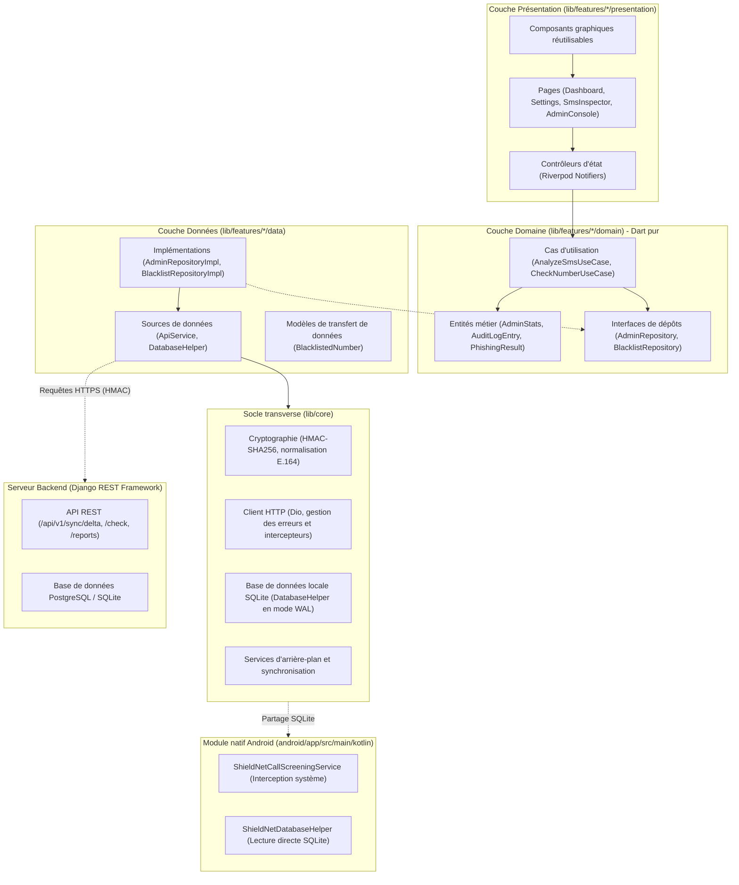
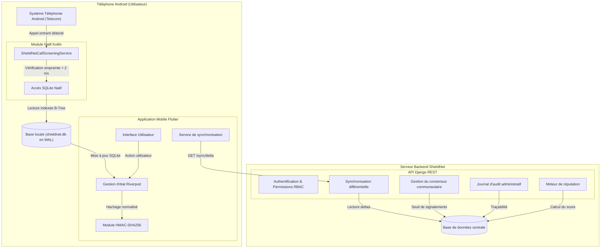
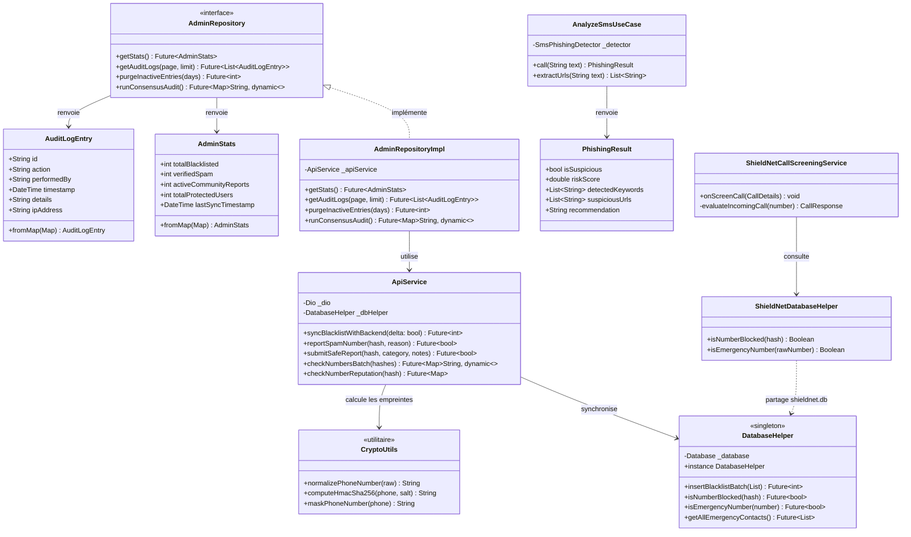
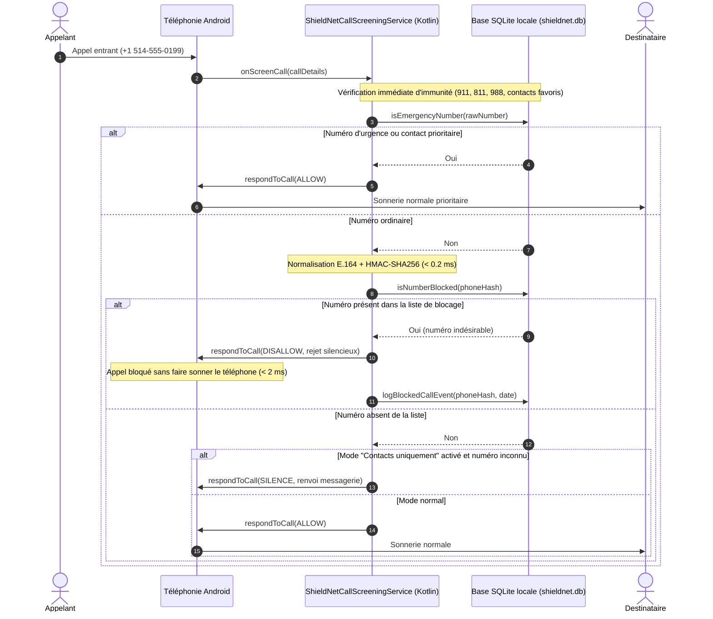
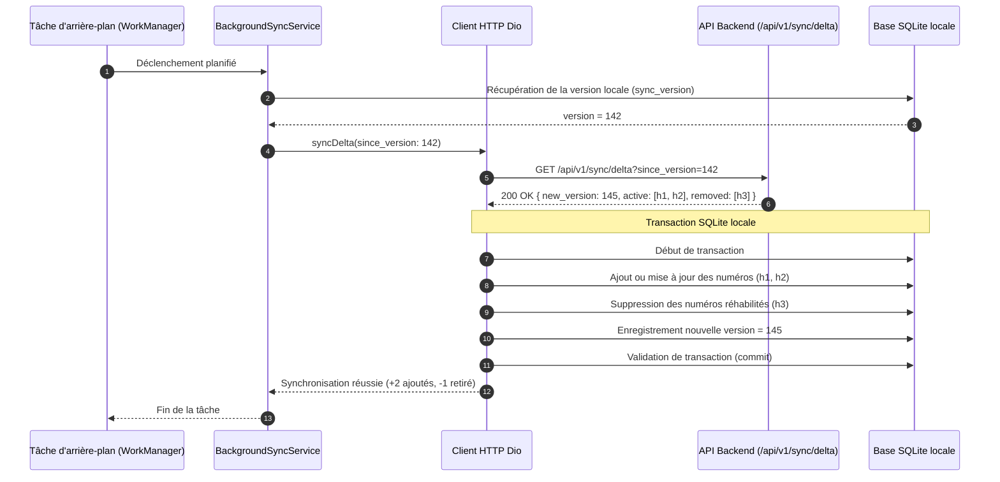
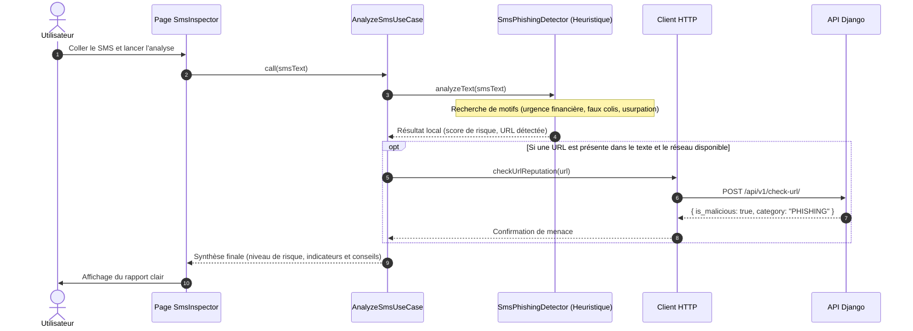
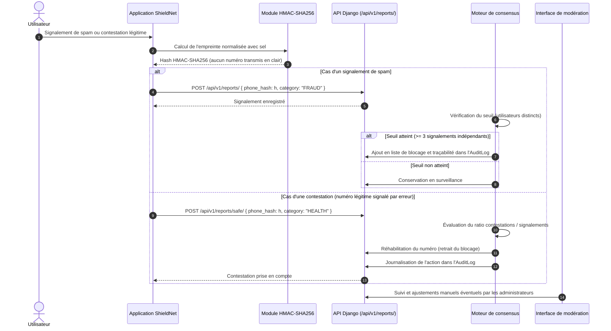

# Architecture logicielle et conception — ShieldNet

Ce document détaille l'architecture globale, la modélisation des composants et les flux de données du projet **ShieldNet**. Il présente les choix d'ingénierie retenus pour concilier réactivité en temps réel sur mobile, fonctionnement hors-ligne (*offline-first*) et protection rigoureuse de la vie privée.

---

## 1. Principes d'architecture et séparation des responsabilités

Le système ShieldNet est articulé autour de trois environnements complémentaires :

1. **L'application mobile (Flutter / Dart)** : Fournit l'interface utilisateur réactive, la gestion d'état avec Riverpod et les appels réseau avec Dio en gérant le cache et les erreurs hors-ligne.
2. **Le module natif Android (Kotlin)** : Implémente le `CallScreeningService` du système d'exploitation pour intercepter les appels entrants en temps réel, avec une contrainte de réponse rapide (< 100 ms).
3. **Le backend (Django / Python)** : Propose une API REST, la gestion des comptes et permissions (RBAC), le moteur de réputation collaborative et un journal d'audit pour les actions administratives.

Afin de faciliter la maintenance et d'éviter un couplage fort avec les bibliothèques externes, le code Flutter suit les principes de la **Clean Architecture** :

### Avantages de ce découpage
- **Indépendance des règles métier** : Le calcul du score de risque, l'analyse heuristique des SMS et les logiques de décision ne dépendent d'aucun framework graphique.
- **Facilité des tests** : Les interfaces permettent d'injecter facilement des mocks lors des tests automatisés (35 tests côté Flutter et 74 tests côté Django, soit 109 tests au total).

---

## 2. Diagramme de composants du système

L'application a été conçue selon une approche *offline-first*. Même en l'absence de réseau mobile ou Wi-Fi, le filtrage téléphonique reste 100 % opérationnel grâce à la base de données locale synchronisée.

---

## 3. Diagramme de classes UML (Client mobile)

Voici l'organisation des classes et interfaces principales du client Flutter :

---

## 4. Application pratique des principes SOLID

La structure du code s'appuie sur les principes de conception orientée objet :

| Principe | Application concrète dans ShieldNet |
|---|---|
| **Responsabilité unique (SRP)** | Chaque classe a une tâche bien délimitée. Par exemple, `CryptoUtils` s'occupe exclusivement de la normalisation et du hachage, tandis que `AnalyzeSmsUseCase` gère l'évaluation de texte sans se soucier de l'affichage. |
| **Ouvert / Fermé (OCP)** | Les règles d'évaluation peuvent être étendues (ajout de nouveaux critères, filtres par indicatif, etc.) sans altérer la logique centrale de stockage ou de présentation. |
| **Substitution de Liskov (LSP)** | Les implémentations de dépôts (`AdminRepositoryImpl`) respectent strictement les contrats d'interface, ce qui permet de les remplacer par des simulacres (*mocks*) dans les tests sans surprise. |
| **Ségrégation des interfaces (ISP)** | Les interfaces sont divisées par fonctionnalités (administration, vérification de numéros, analyse SMS) pour éviter que les composants ne dépendent de méthodes superflues. |
| **Inversion des dépendances (DIP)** | Les contrôleurs d'affichage dépendent d'abstractions de cas d'utilisation injectées par Riverpod, plutôt que d'instancier directement des classes de bas niveau (comme les clients HTTP). |

---

## 5. Flux fonctionnels clés

### 5.1. Interception d'un appel entrant en temps réel (< 2 ms)
Lorsqu'un appel arrive, le système Android transmet le numéro au service d'interception. La priorité absolue est donnée à la non-interférence avec les numéros d'urgence :

---

### 5.2. Synchronisation incrémentale (Delta Sync)
Pour économiser la bande passante mobile et la batterie, le client ne télécharge pas l'ensemble de la base à chaque fois. Il demande uniquement les changements intervenus depuis sa dernière version connue :

---

### 5.3. Analyse de SMS dans l'inspecteur
L'utilisateur peut coller un message douteux pour obtenir une évaluation immédiate. Le texte reste analysé localement sur le terminal, préservant la confidentialité des correspondances privées :

---

### 5.4. Signalement participatif et modération par consensus
Le modèle collaboratif permet aux utilisateurs de signaler les numéros indésirables, tout en prévenant les abus grâce à un seuil de consensus :

