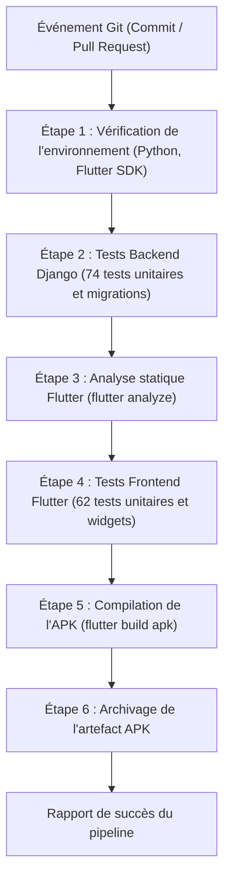

# Guide de déploiement et intégration continue (CI/CD) — ShieldNet

Ce guide explique comment installer, configurer et déployer les différents services de **ShieldNet**, aussi bien pour un environnement de développement local qu'en production, ainsi que le fonctionnement du pipeline d'intégration continue sous Jenkins.

---

## 1. Vue d'ensemble des composants

L'infrastructure s'articule autour de services éprouvés, simples à maintenir et à conteneuriser :

| Composant | Rôle | Notes techniques |
|---|---|---|
| **Django 5 & DRF** | API REST & Administration web | Gestion des utilisateurs, modération des signalements, calcul de réputation et journal d'audit. |
| **Gunicorn** | Serveur d'application WSGI | Exécute les processus applicatifs Django en production derrière le proxy. |
| **Nginx** | Serveur web & Reverse Proxy | Terminaison HTTPS (TLS 1.3), distribution directe des fichiers statiques et transmission des requêtes à Gunicorn. |
| **PostgreSQL 16** | Base de données principale | Stockage relationnel optimisé avec index B-Tree sur les empreintes hexadécimales HMAC (SQLite utilisable en local). |
| **Redis 7** | Cache et limitation de requêtes | Utilisé pour le cache applicatif et la limitation du débit de requêtes (*rate limiting*). |
| **Jenkins LTS** | Intégration continue | Exécution automatique des 109 tests (74 backend, 35 mobile), vérification du linter et compilation de l'APK Android. |

---

## 2. Configuration des variables d'environnement (.env)

Avant de lancer le serveur, créez ou ajustez le fichier `shieldnet_backend/.env` avec vos paramètres locaux :

```ini
# Paramètres généraux
DEBUG=False
SECRET_KEY=votre_cle_secrete_django_a_remplacer_ici
ALLOWED_HOSTS=api.shieldnet.app,127.0.0.1,localhost

# Base de données PostgreSQL (ou configuration SQLite pour le développement)
DB_ENGINE=django.db.backends.postgresql
DB_NAME=shieldnet_prod
DB_USER=shieldnet_admin
DB_PASSWORD=votre_mot_de_passe_base_de_donnees
DB_HOST=127.0.0.1
DB_PORT=5432

# Sel cryptographique pour le hachage HMAC-SHA256 (doit être identique sur le client mobile)
HMAC_SECRET_SALT=votre_sel_cryptographique_secret_et_robuste

# Sécurité des sessions et jetons JWT
JWT_ACCESS_TOKEN_LIFETIME_MINUTES=15
JWT_REFRESH_TOKEN_LIFETIME_DAYS=7
ADMIN_PASSWORD=mot_de_passe_administrateur_initial

# Sécurité HTTP en production (désactiver si test en HTTP local)
SECURE_SSL_REDIRECT=True
SESSION_COOKIE_SECURE=True
CSRF_COOKIE_SECURE=True
SECURE_HSTS_SECONDS=31536000
CORS_ALLOWED_ORIGINS=https://admin.shieldnet.app
```

---

## 3. Déploiement du serveur

### Option A : Déploiement avec Docker Compose (Recommandé)

Cette méthode permet de démarrer l'ensemble des briques en quelques commandes :

1. **Construire et lancer les conteneurs :**
   ```bash
   docker compose up -d --build
   ```

2. **Appliquer les migrations de base de données et collecter les fichiers statiques :**
   ```bash
   docker compose exec web python manage.py migrate --noinput
   docker compose exec web python manage.py collectstatic --noinput
   ```

3. **Créer les comptes de départ nécessaires :**
   ```bash
   docker compose exec web python manage.py ensure_admin
   docker compose exec web python manage.py ensure_manager
   ```

---

### Option B : Installation manuelle sur serveur Linux (Ubuntu / Debian)

1. **Installer les paquets système :**
   ```bash
   sudo apt update && sudo apt install -y python3-venv python3-pip postgresql nginx certbot python3-certbot-nginx
   ```

2. **Configurer l'environnement virtuel Python :**
   ```bash
   cd /var/www/shieldnet_backend
   python3 -m venv venv
   source venv/bin/activate
   pip install --upgrade pip
   pip install -r requirements.txt
   ```

3. **Préparer la base et les fichiers statiques :**
   ```bash
   python manage.py migrate
   python manage.py collectstatic --noinput
   ```

4. **Créer le service systemd (`/etc/systemd/system/shieldnet.service`) :**
   ```ini
   [Unit]
   Description=Serveur applicatif Gunicorn pour ShieldNet
   After=network.target postgresql.service

   [Service]
   User=www-data
   Group=www-data
   WorkingDirectory=/var/www/shieldnet_backend
   ExecStart=/var/www/shieldnet_backend/venv/bin/gunicorn \
             --workers 3 \
             --bind 127.0.0.1:8000 \
             --access-logfile /var/log/shieldnet/access.log \
             --error-logfile /var/log/shieldnet/error.log \
             shieldnet_backend.wsgi:application

   Restart=always

   [Install]
   WantedBy=multi-user.target
   ```

5. **Démarrer et activer le service :**
   ```bash
   sudo systemctl daemon-reload
   sudo systemctl enable shieldnet
   sudo systemctl start shieldnet
   ```

6. **Exemple de configuration Nginx (`/etc/nginx/sites-available/shieldnet`) :**
   ```nginx
   server {
       server_name api.shieldnet.app;

       location /static/ {
           alias /var/www/shieldnet_backend/staticfiles/;
       }

       location / {
           proxy_pass http://127.0.0.1:8000;
           proxy_set_header Host $host;
           proxy_set_header X-Real-IP $remote_addr;
           proxy_set_header X-Forwarded-For $proxy_add_x_forwarded_for;
           proxy_set_header X-Forwarded-Proto $scheme;
       }
   }
   ```

---

## 4. Pipeline d'intégration continue (Jenkins)

Le fichier `Jenkinsfile` automatise la validation de la qualité de code à chaque modification. Il enchaîne les étapes de tests et de construction pour vérifier qu'aucune régression n'a été introduite :



### Détail des vérifications :
1. **Environnement** : Détection des exécutables nécessaires (`python`, `flutter`, `git`) sur la machine de build.
2. **Backend Django** : Exécution des 74 tests unitaires et d'API (`python manage.py test shield_api`) et vérification de la cohérence des migrations (`makemigrations --check`).
3. **Analyse statique Dart** : Contrôle du respect des bonnes pratiques avec `flutter analyze` (aucun avertissement bloquant toléré).
4. **Tests Frontend Mobile** : Exécution des 62 tests Flutter couvrant la cryptographie HMAC, le masquage des numéros, l'interception et le bon comportement des widgets d'affichage.
5. **Compilation** : Génération du paquet d'installation Android (`app-release.apk`).
6. **Archivage** : Mise à disposition du binaire compilé dans les artefacts de build de Jenkins.

### Démarrage rapide de Jenkins en local :
```bash
docker compose -f docker-compose.jenkins.yml up -d
docker exec shieldnet_jenkins cat /var/jenkins_home/secrets/initialAdminPassword
```
Interface accessible à l'adresse : `http://localhost:8080`

---

## 5. Commandes utiles pour l'administration et l'exploitation

### Vérification de l'état du serveur
```bash
# Vérification du point de santé de l'API
curl -I http://127.0.0.1:8000/api/v1/health/

# Consultation des métriques de base
curl http://127.0.0.1:8000/api/v1/metrics/
```

### Tâches d'entretien régulier
```bash
# Nettoyage des signalements inactifs de plus de 90 jours
python manage.py purge_stale_reports --days=90

# Réévaluation manuelle du consensus communautaire
python manage.py run_consensus_audit
```

---

## 6. Stratégie de résilience et sauvegarde

- **Fonctionnement hors-ligne autonome** : L'application mobile n'a pas besoin d'une connexion permanente pour filtrer les appels. Sa base SQLite locale synchronisée lui permet de continuer à protéger l'utilisateur même en zone blanche ou en mode avion.
- **Synchronisation automatique** : Dès que l'accès Internet est rétabli, l'application récupère les dernières modifications par incréments sans perturber l'expérience utilisateur.
- **Sauvegarde de la base de données PostgreSQL** :
  ```bash
  pg_dump -U shieldnet_admin shieldnet_prod | gzip > /backups/shieldnet_$(date +%Y%m%d).sql.gz
  ```